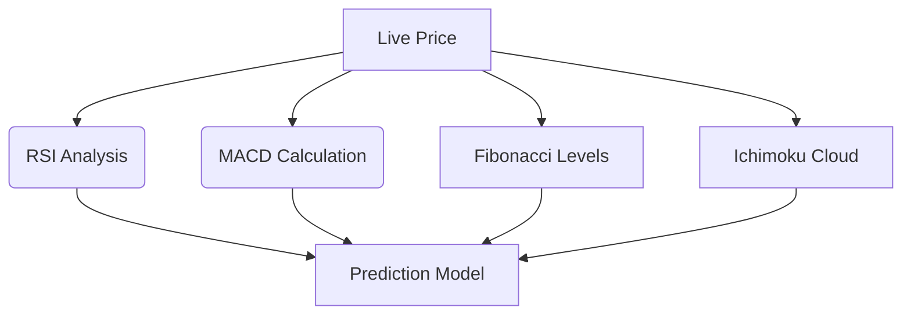

# PRECOG BTC - Advanced Bitcoin Prediction System


**Predict Bitcoin's future with mathematical precision**  
Combines advanced technical analysis with adaptive AI to generate reliable trading signals

## What is PRECOG BTC?

PRECOG BTC is a financial prediction system that uses advanced algorithms and technical analysis to anticipate Bitcoin price movements. Unlike traditional tools:

✅ Combines **12+ technical indicators** in real-time  
✅ Applies the **golden ratio** to identify turning points  
✅ Generates **consensus signals** through adaptive AI  
✅ Provides **actionable recommendations** with precise levels

> "PRECOGs work better in packs. When multiple instances agree, the signal is stronger than any human analysis"

## 💡 The Pack Hack: Boost Your Results

Discover the secret to ultra-reliable signals:

```markdown
1️⃣ **Open 3+ Tabs** 
   - Visit https://precog-btc.vercel.app in 3+ browser tabs
   - Each tab is an independent PRECOG (Agatha, Dash, Arthur...)

2️⃣ **Wait 15 Minutes**
   - Let each AI adapt to market conditions
   - Algorithms improve with runtime

3️⃣ **Seek Consensus**
   - Strong Signal: 80%+ PRECOGs agree → High confidence
   - Weak Signal: Prediction discrepancy → Wait for confirmation
```

This method leverages "machine wisdom" - each instance develops complementary biases during execution, creating a collective prediction system more accurate than any individual model.

## How the PRECOG System Works

The PRECOG system operates through a multi-layered approach:

1. **Data Collection Layer:**
   - Real-time market data from APIs
   - Intelligent caching system
   - Continuous price updates (every 3 seconds)

2. **Technical Analysis Engine:**


3. **Adaptive Prediction Core:**
   - Golden Momentum algorithm
   - Multi-timeframe consensus
   - Real-time confidence scoring

4. **Trading Intelligence:**
   - Position optimization
   - Dynamic stop-loss algorithms
   - Harmonic profit targets

## Advanced Technology Under the Hood

| Layer               | Technologies                                 | Function                             |
|---------------------|---------------------------------------------|--------------------------------------|
| **Data Ingestion**  | WebSockets, CryptoCompare API, Binance API  | Real-time data with smart caching    |
| **Processing**      | Web Workers, Float64Arrays                  | Parallel computations                |
| **Analysis**        | Custom EMA/MACD, Golden Ratio algorithms    | Complex pattern detection            |
| **Visualization**   | Chart.js + plugins, CSS Variables           | Interactive responsive charts        |
| **Adaptation**      | Autoregressive models                       | Continuous market adaptation         |


## Key System Metrics

| Metric               | Optimal        | Risk Zone      | Interpretation                     |
|----------------------|----------------|----------------|------------------------------------|
| **Confidence**       | >80%           | <50%           | Prediction reliability             |
| **Golden Momentum**  | >5%            | <-3%           | Trend strength                     |
| **Volatility**       | 15-25%         | >35%           | Risk of sharp movements            |
| **Historical Acc.**  | >85%           | <70%           | Model effectiveness                |
| **Fib Levels**       | 8+/12          | <4/12          | Support/resistance proximity       |

## How to Interpret Signals

1. **PRECOG Prediction (Orange):**
   - Consensus price across timeframes
   - Primary trading target

2. **Trend (Green/Red Gradient):**
   - Color intensity = expected move strength
   - Dark green: Strong bullish momentum
   - Dark red: Potential crash

3. **Golden Momentum:**
   - >0% = Bullish momentum (buy dips)
   - <0% = Bearish momentum (sell rallies)

4. **Fib Levels:**
   - 8+/12 = Price in reversal zone
   - <4/12 = Strong trend continuation

## Mathematical Safeguards

PRECOG BTC incorporates three key protection mechanisms:

1. **Fibonacci Weighting:**
   ```javascript
   FIB_WEIGHTS: { 0.236: 0.8, 0.382: 1.0, 0.5: 0.9, 0.618: 1.0 }
   ```

2. **Confidence Boundaries:**
   ```javascript
   Math.min(100, Math.max(0, historicalAccuracy * volatilityImpact))
   ```

3. **Cross-validation:** Compares predictions across timeframes

## Real-Time Adaptation Process

The system continuously recalibrates:
```javascript
setInterval(updateCurrentPrice, 3000);  // 3-second price updates
setInterval(loadData, 180000);          // 3-minute full analysis
setInterval(calculatePrecog, 30000);    // 30-second PRECOG updates
```

## License
MIT License - Free for analysis and research. Commercial use prohibited without authorization.

---

**Disclaimer:**  
PRECOG BTC is an educational tool. Cryptocurrencies are high-risk assets. Never invest more than you can afford to lose. Past predictions do not guarantee future results.
